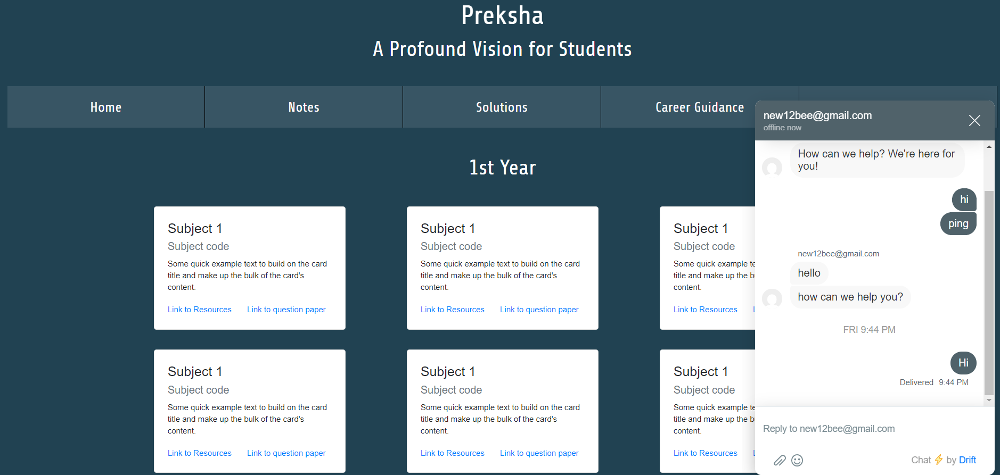

<h1 align="center"><b> TEAM CODE CLAN INITIATIVE </b></h1>

    
   

  
  
    
  
 
  

 

 

## COMMUNITY AND CONTRIBUTIONS:
When contributing to this repository, please first discuss the change you wish to make via issue, email, or any other method with the owners of this repository before making a change. Please note we have a code of conduct, follow it in all your interactions with the project.

## FOUND A BUG? Missing a specific feature?

Feel free to **file a new issue** with a respective title and description on the repository. If you already found a solution to your problem, **we would love to review your pull request**! Have a look at our [contribution guidelines](https://github.com/AnanyaNegi/Vizen-Codeoverflow/blob/main/CONTRIBUTING.md) to find out about our coding standards.

## LICENSE:
The Project is released under the terms of the [MIT License](LICENSE).

 
 

    

 
